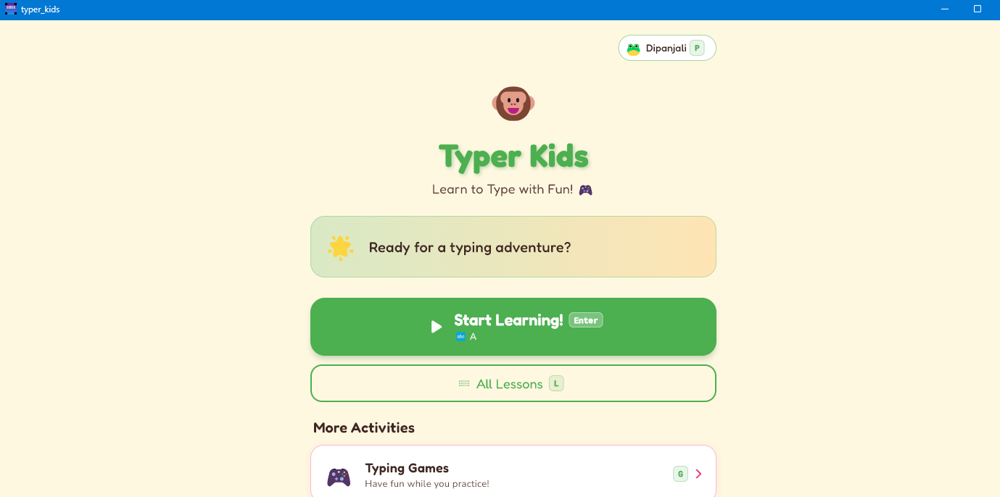

# Typer Kids ⌨️

A fun, colorful typing tutor built with Flutter — designed to help kids learn touch typing through structured lessons and arcade-style games.

<p align="center">
  
</p>

## ✨ Features

### 📚 187 Structured Lessons
- **Individual letter tracks** — each key gets dedicated intro + practice
- **Progressive difficulty** — Beginner 🌱, Intermediate 🌿, Advanced 🌳
- **6 categories** — Home Row, Top Row, Bottom Row, Numbers, Common Words, Sentences
- **Star ratings** (1–5 ⭐) based on accuracy
- **Fun tips** and encouraging mascot 🐵

### 🎮 3 Arcade Games
| Game | Description |
|------|-------------|
| **Falling Words** ⬇️ | Type words before they hit the bottom. Lives system and streaks. |
| **Word Bubbles** 🫧 | Pop floating bubbles by typing them before they fade away. |
| **Speed Chase** 🏎️ | Race a ghost car — type words fast to stay in the lead. |

Each game has 3 difficulty levels, high score tracking, sound effects, and visual feedback (ghost indicators, color-coded match borders).

### ⌨️ Visual Keyboard
- On-screen QWERTY keyboard with **color-coded finger zones**
- **Active key highlighting** and correct/incorrect feedback
- **Finger guide** showing which hand and finger to use

### 📝 Typing Test
- Timed tests: **30 s, 1 min, 2 min, 5 min**
- 3 difficulty levels with classic literature passages
- Real-time WPM and accuracy tracking
- Timer starts on first keypress

### 🆓 Free Practice
- Untimed sandbox mode with story passages
- Elapsed timer, live WPM and accuracy
- Easy / Medium / Hard content from classic children's literature

### 👤 Multi-Profile Support
- Create and switch between multiple player profiles
- 16 avatar emojis to choose from
- Per-profile progress, stars, and high scores
- Quick switch with number keys (1–9)

### 🔊 Sound Effects
8 synthesized CC0 sound effects — correct, wrong, pop, miss, streak, keystroke, game start, game over — with audio pooling for smooth playback.

### ⚡ Keyboard Shortcuts
Every screen supports keyboard navigation:

| Key | Action |
|-----|--------|
| `Enter` / `Space` | Continue / Start recommended lesson |
| `L` | All Lessons |
| `G` | Games |
| `F` | Free Practice |
| `T` | Typing Test |
| `P` | Profiles |
| `S` | Settings |
| `Esc` | Back |
| `1` `2` `3` | Quick-select in game menu / profiles |

## 🖥️ Platforms

| Windows | macOS | Linux | Web |
|---------|-------|-------|-----|
| ✅ | ✅ | ✅ | ✅ |

## 📥 Installation

Download the latest release for your platform:

**[→ Download from GitHub Releases](https://github.com/lohanidamodar/typer_kids/releases/latest)**

- **Windows** — Extract the ZIP and run `typer_kids.exe`
- **macOS** — Mount the DMG and drag to Applications
- **Linux** — Extract the tar.gz and run `typer_kids`

## 🛠️ Build from Source

**Prerequisites:** [Flutter SDK](https://docs.flutter.dev/get-started/install) (3.11+)

```bash
# Clone the repository
git clone https://github.com/lohanidamodar/typer_kids.git
cd typer_kids

# Install dependencies
flutter pub get

# Run on your current platform
flutter run

# Build a release
flutter build windows   # or macos / linux / web
```

### Generate Assets

```bash
# Regenerate app icon
dart run tool/generate_icon.dart
dart run flutter_launcher_icons

# Regenerate sound effects
dart run tool/generate_sfx.dart

# Regenerate README banner
dart run tool/generate_banner.dart
```

## 🏗️ Tech Stack

| Layer | Technology |
|-------|------------|
| Framework | [Flutter](https://flutter.dev) (Dart SDK ^3.11.0) |
| State Management | [Provider](https://pub.dev/packages/provider) |
| Routing | [go_router](https://pub.dev/packages/go_router) |
| Storage | [SharedPreferences](https://pub.dev/packages/shared_preferences) |
| Typography | [Google Fonts](https://pub.dev/packages/google_fonts) (Fredoka + Nunito) |
| Audio | [audioplayers](https://pub.dev/packages/audioplayers) |
| Animations | [confetti](https://pub.dev/packages/confetti) |
| Icon Generation | [image](https://pub.dev/packages/image) + [flutter_launcher_icons](https://pub.dev/packages/flutter_launcher_icons) |

## 📁 Project Structure

```
lib/
├── core/           # Router, theme, sound manager
├── data/           # Lessons, word lists, story content, keyboard data
├── models/         # Profile, lesson progress
├── providers/      # ProfileProvider, ProgressProvider
├── screens/        # All app screens (home, lessons, games, test, sandbox)
└── widgets/        # Keyboard, typing display, finger guide, star rating, mascot
tool/               # Asset generation scripts (icon, SFX, banner)
assets/sounds/      # 8 CC0 WAV sound effects
```

## 📄 License

This project is licensed under the **GNU General Public License v3.0** — see the [LICENSE](LICENSE) file for details. You are free to use, modify, and distribute this software, but any derivative work must also be open-sourced under GPL v3.

## 🙏 Credits

Built by [Damodar Lohani](https://github.com/lohanidamodar).

Sound effects are original CC0 synthesized WAVs. Story passages adapted from public domain classic literature.
